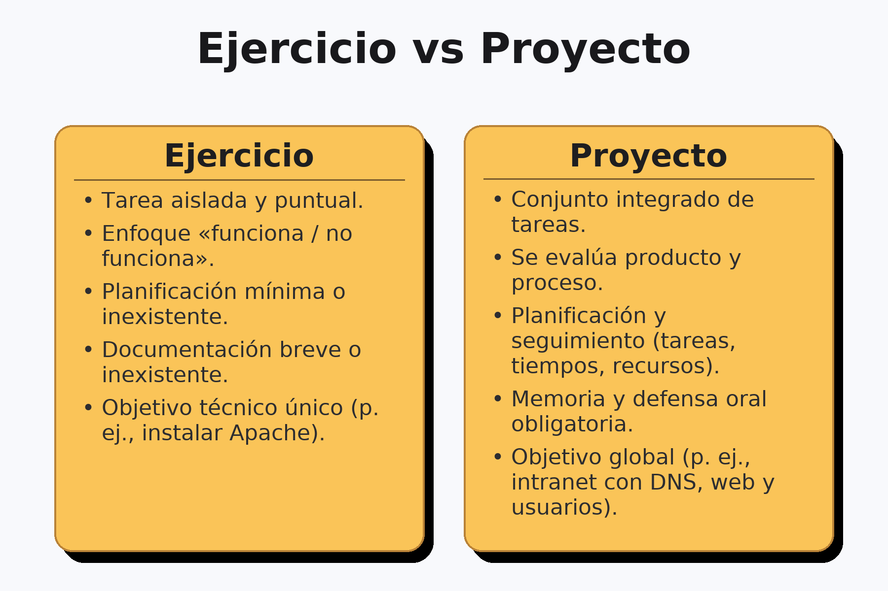

# Introducción a la metodología de proyectos

## ¿Qué es un proyecto?

En este módulo se trabajará como en el mundo profesional: se plantea una necesidad, se analiza, se diseña una solución, se implanta y se comprueba. Un proyecto tiene inicio y fin, un objetivo explícito y unos recursos limitados. No se trata de “hacer cosas” sueltas, sino de construir un resultado útil y explicar cómo se ha llegado a él. Un ejercicio como instalar un servidor FTP entrena una habilidad; un proyecto como desplegar un almacenamiento compartido con control de usuarios obliga a integrar habilidades, planificar, documentar y presentar. Esa diferencia marca el enfoque del módulo desde el primer día.

## Ejercicio práctico frente a proyecto

Cuando se habla de proyecto, se evalúa producto y proceso. Importa que funcione, pero también cómo se planifican las tareas, cómo se toman decisiones técnicas y cómo se justifican. Importa la documentación y la comunicación: se debe poder reproducir el trabajo, mantenerlo y transferirlo a otra persona.

- En un ejercicio, el criterio dominante es “funciona/no funciona”.
- En un proyecto, además del funcionamiento, se valoran: planificación, trazabilidad de cambios, pruebas, calidad de la memoria y presentación.

## Fases de un proyecto TIC

Un proyecto TIC avanza en cinco fases encadenadas pero iterativas: al detectar un problema en pruebas, se puede volver al diseño; si en el análisis aparecen nuevas restricciones, se ajusta el plan. Entender que el flujo no es rígido evita bloqueos y mejora la calidad del resultado.

- **Análisis de requisitos**: entender qué se necesita exactamente, bajo qué límites y cómo sabremos que está bien hecho.
- **Diseño**: decidir cómo se va a construir la solución, con qué piezas, quién hace qué y en qué orden.
- **Desarrollo/implantación**: ejecutar el plan: instalar, configurar e integrar.
- **Pruebas y verificación**: comprobar de forma objetiva que se cumplen los requisitos.
- **Documentación y presentación**: dejar por escrito lo hecho y defenderlo con una explicación clara.

### Análisis de requisitos

El análisis es la base del proyecto: si aquí se es ambiguo, todo lo demás se tambalea. El objetivo es convertir necesidades en requisitos claros y verificables, incluyendo restricciones y criterios de éxito medibles.

Qué se persigue:

- Identificar necesidades (lo que el usuario quiere lograr) y objetivos (lo que el sistema hará para lograrlo).
- Establecer restricciones: tiempo (plazos), materiales (presupuesto, hardware disponible), conocimientos (tecnologías que dominamos) y cualquier política del centro/empresa.
- Definir criterios de éxito: indicadores que permitirán afirmar “esto está terminado y funciona”.

Cómo se trabaja:

Se conversa con los interesados (profesor/cliente, usuarios), se revisa el entorno (aula, red, seguridad) y se toma nota de requisitos funcionales (p. ej., “los 20 PCs deben unirse al dominio y arrancar en <30 s”) y no funcionales (rendimiento, seguridad, mantenibilidad). Conviene priorizar (por ejemplo, con MoSCoW: Must, Should, Could, Won’t) y acordar qué queda fuera.

#### Tabla modelo de requisitos

| ID  | Requisito | Tipo | Criterio de aceptación |
| -- | -- | -- | -- |
| RF-01 | 20 equipos conectados a la red | Funcional | 20/20 hacen ping |
| RF-02 | Inventario de Hardware/OS | Funcional | Hoja actualiza y firmada |
| RNF-01 | Tiempo de arranque <30 s | No funcional | Media <30 s en 5 pruebas |

### Diseño

Con requisitos claros, el diseño convierte el “qué” en un “cómo” realista. No es solo un dibujo: es tomar decisiones justificadas, anticipar tareas y coordinar al equipo.

Qué se persigue:

- Elegir topología (red, servidores, servicios), roles (quién hace qué) y opciones técnicas (SO, servidores DHCP/DNS, hipervisores, switches, etc.).
- Elaborar un plan de tareas ordenado y estimado (desglose en subtareas), con riesgos y dependencias.

Cómo se trabaja:

Se comparan alternativas (p. ej., “DHCP en router vs. servidor Windows/Linux”), se justifica la elección (coste, soporte, conocimientos) y se detalla la arquitectura lógica y física. Se añade un plan de direccionamiento IP, políticas básicas de seguridad y un cronograma realista.

#### Tabla de comparación técnica

| Opción | Ventajas | Inconvenientes | Decisión |
| -- | -- | -- | -- |
| DHCP en el router | Simplicidad | Menor control/logs | ❌ |
| DHCP en el servidor | Centralizado, trazable | Requiere mantenimiento | ✅ |

### Desarrollo e implantación

Aquí “se tocan máquinas”. La clave es seguir el plan con disciplina, registrar cambios y generar evidencias (capturas, scripts, versiones) que luego facilitarán pruebas y documentación.

Qué se persigue:

- Instalar SO, servicios y aplicaciones según diseño.
- Configurar y integrar todos los componentes (p. ej., unir PCs al dominio, enlazar DHCP/DNS, montar perfiles, desplegar políticas).

Buenas prácticas operativas:

- Preparar un entorno de pruebas mínimo antes de producción.
- Hacer copias de seguridad/puntos de restauración antes de cambios críticos.
- Usar control de versiones (incluso para scripts y plantillas).
- Mantener un registro de cambios (qué, cuándo, por qué).
- Dejar parametrizados los scripts para repetir instalaciones.

Entregables mínimos:

- Checklist de instalación cumplimentada.
- Scripts/plantillas usados y evidencias (capturas con pie de foto).

### Pruebas y verificación

Probar no es “ver si funciona por encima”, sino demostrar que cada requisito se cumple con casos de prueba diseñados y repetibles. Cuanto más medible, mejor.

Qué se persigue:

- Validar requisitos con casos de prueba bien definidos (precondiciones, pasos, resultado esperado).
- Registrar incidencias con severidad/prioridad y re–probar tras corregir.

Tipos de prueba útiles en Grado Medio:

- De instalación/configuración (servicios se levantan, puertos abiertos correctos).
- Funcionales (el usuario puede iniciar sesión, obtener IP, acceder a un recurso).
- Integración (AD + DHCP + DNS funcionan juntos).
- Rendimiento básico (arranque, tiempos de login, copia de ficheros).
- Aceptación (cliente/profesor valida criterios de éxito).

#### Plantillas clave

**Criterios de aceptación**

- *CA-01: (qué se prueba y cómo se valida, cada requisito debe tener al menos un CA que indique cómo se verificará. Debe ser objetivo y repetible)*

**Matriz de requisitos**

| Req | Criterio de aceptación | ¿Cumplido? (Sí/No) |
| -- | -- | -- |
| RF-01 | CA-01 | Sí |
| RNF-01 | CA-02 | NO |

### Documentación y presentación

Un proyecto no termina hasta que se puede entender y mantener. La documentación evita depender de una persona concreta y la presentación sirve para defender decisiones y mostrar resultados.

Memoria técnica: estructura sugerida

1. Resumen ejecutivo (qué problema se resolvió, en qué plazo y con qué resultado).
2. Contexto y requisitos (síntesis del DR).
3. Diseño (topología, decisiones técnicas y su justificación).
4. Implantación (procedimientos, scripts, incidencias relevantes).
5. Pruebas (plan, resultados, evidencias y trazabilidad).
6. Manual de usuario (operaciones básicas) y manual de administración (tareas de mantenimiento).
7. Conclusiones y trabajos futuros realistas (mejoras que encajarían en otro sprint/fase).

## Herramientas de apoyo y convenciones de trabajo

La gestión puede hacerse con recursos sencillos, pero conviene establecer convenciones desde el inicio para que el trabajo sea ordenado y replicable.

- **Planificación**: tablero Kanban (Trello) o checklist en Google Docs con tres columnas mínimas: Por hacer, En curso, Hecho. Las tarjetas deben incluir una descripción corta y checklist de subtareas.
- **Documentación**: Google Docs o Word para memorias; cuando proceda, Markdown y repositorio (GitHub/GitLab) para versiones de archivos. Estructura de carpetas recomendada: /proyecto/doc, /proyecto/capturas, /proyecto/config.
- **Diagramas**: diagrams.net (draw.io) para esquemas; Packet Tracer para topologías de red.
- **Convenciones de nombres**: YYYYMMDD_descripcion_corta.ext para capturas y configuraciones; evita espacios y acentos; usa guiones bajos.

## Buenas prácticas

Resulta fundamental capturar evidencia a medida que se trabaja: capturas de pantalla, configuraciones exportadas y notas de decisiones. También es clave explicitar criterios de éxito antes de empezar a montar nada, para que luego las pruebas sean objetivas. Por último, conviene homogeneizar la estructura mínima de memoria desde el primer ejercicio: objetivo, requisitos, diseño, pasos, pruebas, resultados y conclusiones.